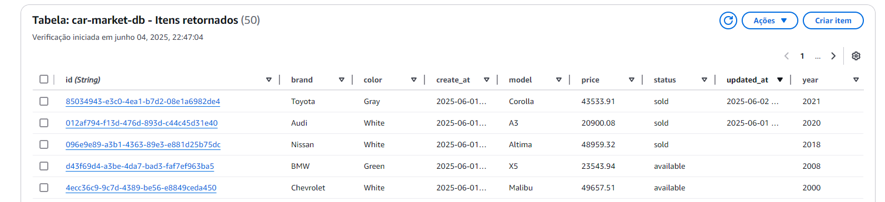
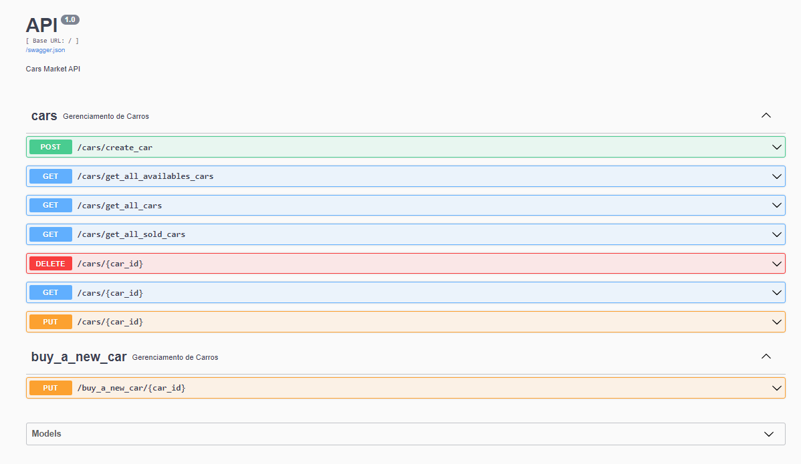
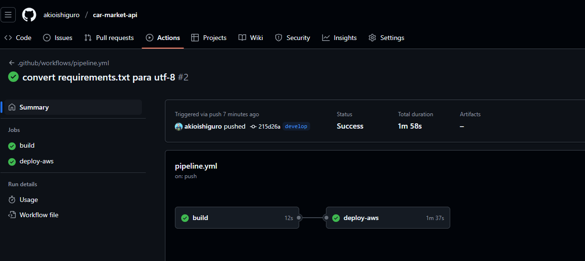
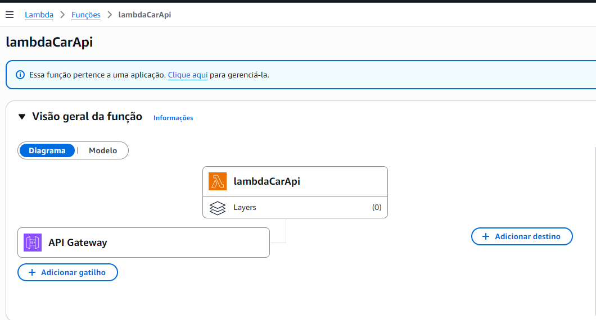

# Lambda Car Market API

## Descrição

Esta aplicação foi criada utilizando Python 3.12 e tem como objetivo o gerenciamento de clientes de um sistema de venda de carros. O código foi desenvolvido para ser executado em uma função AWS Lambda, com o API Gateway da AWS atuando como trigger para as requisições. O sistema é focado na administração de usuários e controle de acessos, utilizando o Amazon Cognito para implementar o gerenciamento de grupos e usuários, garantindo uma abordagem escalável e segura para controle de permissões.

Características específicas do projeto:
- Projeto feito para ser executado em uma função AWS Lambda, permitindo escalabilidade e alta disponibilidade.
- Autenticação através de outra aplicação que se conecta no AWS Cognito, que permite o gerenciamento de usuários e grupos de forma segura e escalável.
- Gerenciamento dos dados em um banco de dados não relacional, como o DynamoDB, para garantir alta performance e flexibilidade na manipulação dos dados.


Vale ressaltar que a aplicação permite a criação, atualização e deleção de carros dentro do sistema, além de permitir  a listagem de veículos à venda, ordenada por preço, do mais barato para o mais caro e listagem de veículos vendidos, ordenada por preço, do mais barato para o mais caro. 

Dentro do banco de dados, os carros são armazenados com as seguintes informações:
- "id": Identificador único do carro.
- "brand": Marca do carro.
- "color": Cor do carro.
- "create_at": Data de criação do registro do carro.
- "model": Modelo do carro.
- "price": Preço do carro.
- "status": Status do carro (disponível ou vendido).
- "updated_at": Data de atualização do registro do carro.
- "year": Ano do carro.




## Como rodar o projeto
Para rodar o serviço certifique-se de ter o Python 3.12 instalado em sua máquina. Além disso, instale as dependências do projeto utilizando `pip`:
```bash
pip install -r requirements.txt
```
Além disso, é necessário adicionar as variáveis de ambiente que se encontram no arquivo `application.env`. As variáveis de ambiente incluem configurações como região da AWS, ID do pool de usuários, ID do cliente, entre outras.

```env
awsRegion=us-east-1
dynamoTableName=
authUrl=http://localhost:8080/auth/validate_token_by_group 
```
Para uso local, o projeto permite a utilização de um swagger para facilitar os testes e a validação das rotas. O Swagger é uma ferramenta que permite a documentação e o teste de APIs de forma interativa.


## Deploy na AWS
Toda a esteira de deploy é feita através do gitachub actions, onde o código é enviado para o branch main e automaticamente é feito o deploy na AWS.



Para realizar o deploy na AWS, utilizamos o AWS SAM CLI (Serverless Application Model). O AWS SAM CLI facilita o build e o deploy de aplicações serverless.
Build: Este comando compila o código-fonte e prepara a aplicação para o deploy.
```bash
sam build
```

Deploy: Este comando empacota e faz o deploy da aplicação na AWS.
```bash
sam deploy
```
O comando sam deploy irá guiá-lo através do processo de configuração do deploy, incluindo a criação de um bucket S3 para armazenar o código-fonte e a configuração das permissões necessárias.

```bash
sam local start-api
```
O comando local start-api irá auxiliar na execução do serviço localmente, para testes e validações.

